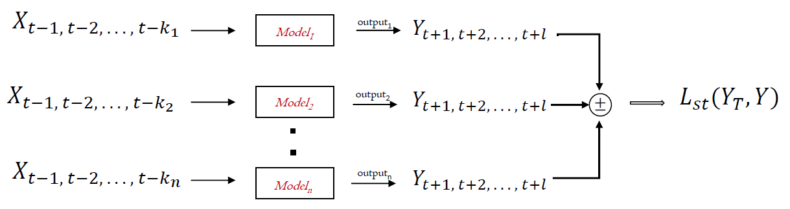

# Forecasting the Performance of Inverter Systems

We provide a docker container to easily build and run the machine learning model for weekly inverter performance based on prior bi-weekly readings. The model utilizes an 8-column csv file with similar column names of (PR, G_M0, T, T_WR1, T_WR2, T_WR3, T_WR4, E_N), such that PR = PERFORMANCE RATIO; G_M0 = Irradiance, T1  ambiant temp, T_WR1 - T_WR4 = internal inverter temps; E_N = nominal energy". As can be found in the sample (dummy) test.csv. To build the Docker container we provide the following files: 
-	Dockerfile
-	inference.py
-	requirements.txt

The inference file accepts a csv file with 14 observations, with the performance value in the first column, while the rest follow order: PR, G_M0, T, T_WR1, T_WR2, T_WR3, T_WR4, E_N respectively. The machine learning model follows the encoder-decoder paradigm, achieved by the CONVLSTM and LSTM layers. 

To solve the large errors from detecting periods with faulty performance i.e., degrading trends not found in training data, the LSTM models are stacked and different time intervals inputs (1, and two weeks prior) are used in training.  The outputs of the models are combined based on attention values learnt in training. Altogether, these components are trained end-to-end.

An illustration of this approach is shown in the figure below, where 
$ `k_1 `$ are different time-windows used in training the model.
```k1 and k2 are 
```math
SE = \frac{\sigma}{\sqrt{n}}
```





The scripts were implemented in tensorflow.


To run:
-   docker build -t [DOCKER_TAG_NAME] .
-   docker run [DOCKER_TAG_NAME]
